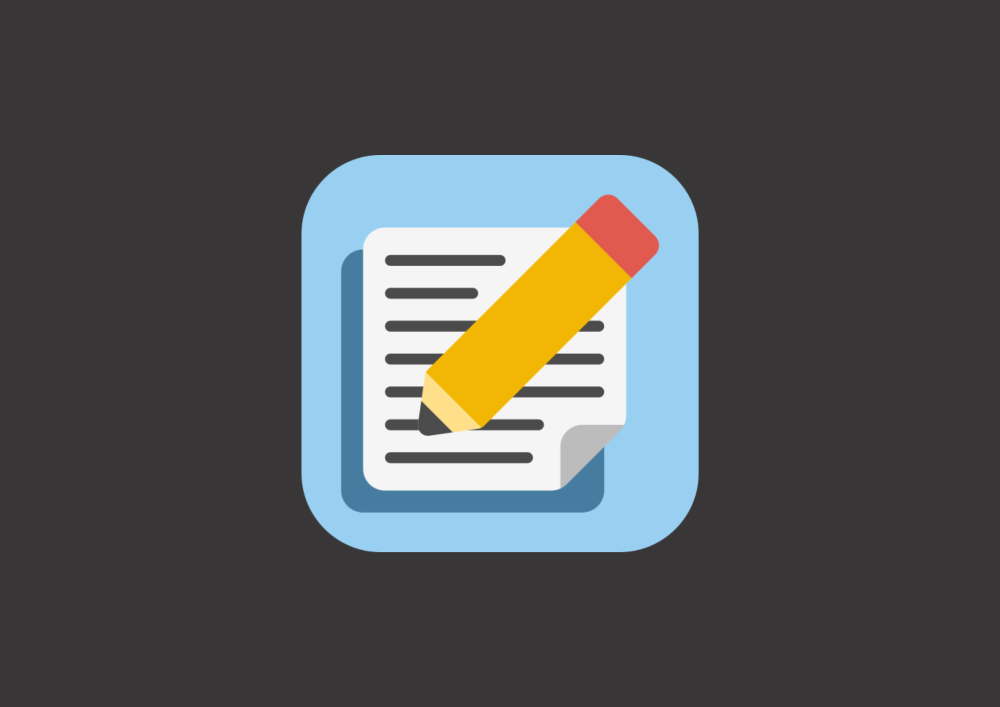
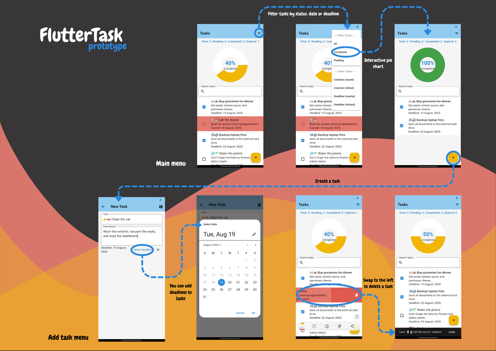
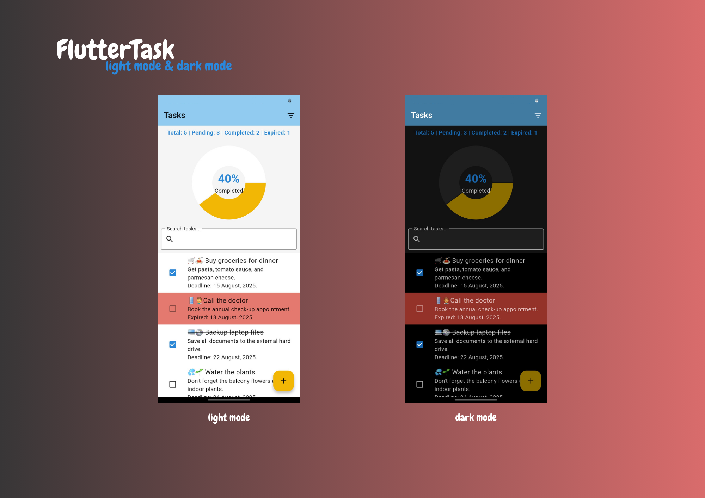

# FlutterTask

  

FlutterTask is a mobile app built with Flutter and Dart to help users manage their tasks efficiently. Users can create tasks, mark them as completed, view pending and completed tasks, filter them by date, and check if any tasks are expired.

## Used technologies

- [**Flutter:**](https://flutter.dev/) A modern UI toolkit for building cross-platform mobile, web, and desktop applications from a single codebase.

- [**Dart:**](https://dart.dev/) A client-optimized language for fast apps on any platform, primarily used with Flutter.

## Characteristics

- Create, edit, and delete tasks.
- Mark tasks as completed or pending.
- View tasks by status: pending or completed.
- Filter tasks by date or deadline.
- Visual indicators for overdue tasks.
- Clear and intuitive user interface.
- Responsive layout for different device sizes.
- Light and fast performance.
- Dark mode support.

## Prototype

  

## Installation

### For users

#### 1. Download APK file from [releases section](https://github.com/PneumaCore/FlutterTask/releases).

#### 2. Enable installation from unknown sources on your Android device.

#### 3. Install the app.

## Screenshots

  

## License

This project is licensed under MIT License.

## Contact

For any questions or suggestions:

- ✉️ Email: luciamengualr18@gmail.com
